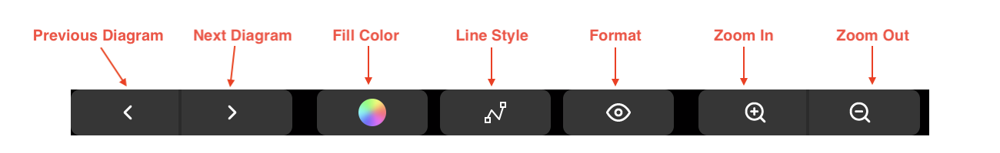
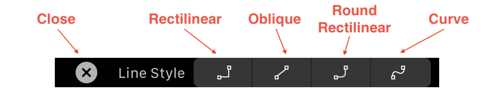
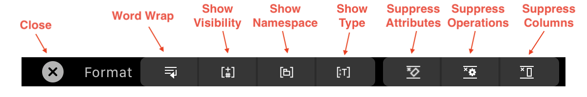

# TouchBar \(MacBook\)

The TouchBar of Apple's MacBook is useful and convenient editing diagram. In TouchBar, there are some buttons frequently used as shown in the below capture.

When you select Line Style button in the TouchBar, a new TouchBar for changing line style is popup as below. By pressing Close button, you can go back to the main TouchBar.

When you select Format button in the TouchBar, a new TouchBar for formatting is popup as below. All buttons are the toggle buttons and you can go back the the main TouchBar when you pressing Close button.

