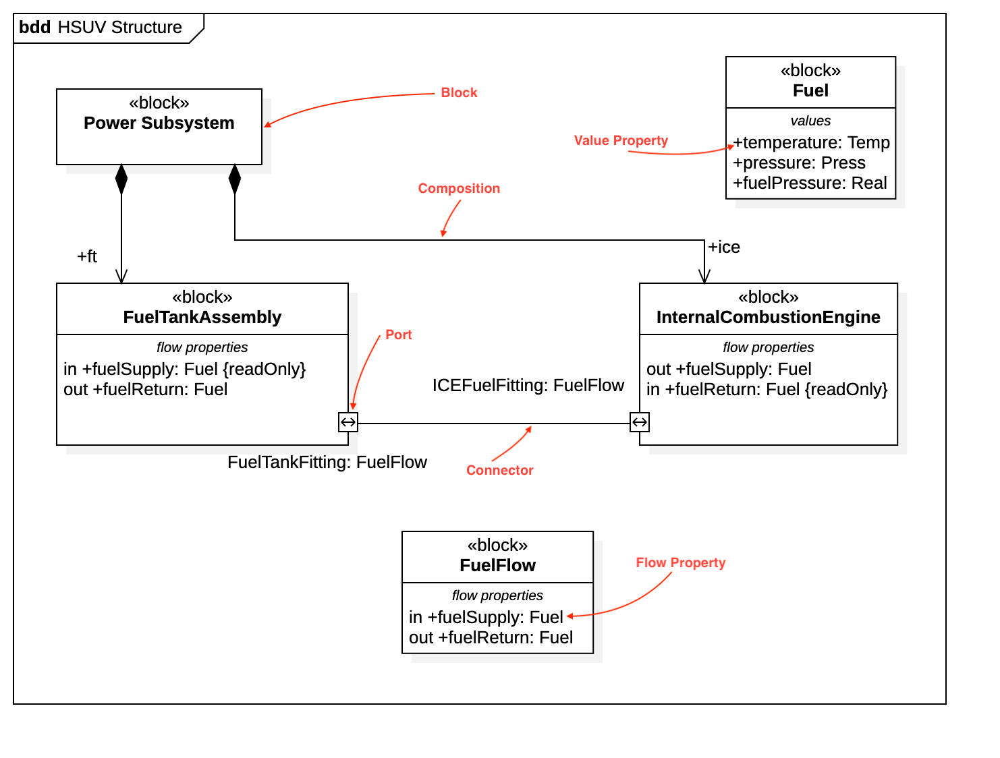

# Block Definition Diagram



## Create Block Definition Diagram

To create a Block Definition Diagram:

1. Select first an element where a new Block Definition Diagram to be contained as a child.
2. Select **Model \| Add Diagram \| Block Definition Diagram** in Menu Bar or select **Add Diagram \| Block Definition Diagram** in Context Menu.

## Block

To create a Block:

1. Select **Block** in **Toolbox**.
2. Drag on the diagram as the size you want.

To create a Block \(model element only\) by Menu:

1. Select an Element where a new Block to be contained.
2. Select **Model \| Add \| Block** in Menu Bar or **Add \| Block** in Context Menu.

You can use **QuickEdit** for Block by double-click or press `Enter` on a selected Block.

* **Name Expression** : Edit name expression.

  _Syntax of Name Expression_

  ```text
  expression ::= [ '<<' stereotype `>>` ] [ visibility ] name
  stereotype ::= (identifier)
  visibility ::= '+' | '#' | '-' | '~'
  name ::= (identifier)
  ```

* **Visibility** : Change visibility property.
* **Add Note** : Add a linked note.
* **Add Constraint** : Add a constraint.
* **Add Part** : Add a part property.
* **Add Reference** : Add a reference property.
* **Add Value** : Add a value property \(typed by ValueType\).
* **Add Flow Property** : Add a flow property.
* **Add Constraint Property** : Add a constraint property.
* **Add Property** : Add a property.
* **Add Operation** : Add an operation.
* **Add Reception** : Add a reception.
* **Add Port** : Add a port.
* **Add Composited Block** : Add a composited block.

To suppress Constraint Properties, check \(or uncheck\) **Format \| Suppress Constraints** in Menu Bar or Context Menu.

To suppress Part Properties, check \(or uncheck\) **Format \| Suppress Parts** in Menu Bar or Context Menu.

To suppress Port Properties, check \(or uncheck\) **Format \| Suppress Ports** in Menu Bar or Context Menu.

To suppress Reference Properties, check \(or uncheck\) **Format \| Suppress References** in Menu Bar or Context Menu.

To suppress Values Properties, check \(or uncheck\) **Format \| Suppress Values** in Menu Bar or Context Menu.

To suppress Properties, check \(or uncheck\) **Format \| Suppress Properties** in Menu Bar or Context Menu.

To suppress Flow Properties, check \(or uncheck\) **Format \| Suppress Flow Properties** in Menu Bar or Context Menu.

## Value Type

To create a Value Type:

1. Select **Value Type** in **Toolbox**.
2. Drag on the diagram as the size you want.

To create a Value Type \(model element only\) by Menu:

1. Select an Element where a new Value Type to be contained.
2. Select **Model \| Add \| Value Type** in Menu Bar or **Add \| Value Type** in Context Menu.

You can use **QuickEdit** for Value Type by double-click or press `Enter` on a selected Value Type.

* **Name Expression** : Edit name expression.

  _Syntax of Name Expression_

  ```text
  expression ::= [ '<<' stereotype `>>` ] [ visibility ] name
  stereotype ::= (identifier)
  visibility ::= '+' | '#' | '-' | '~'
  name ::= (identifier)
  ```

* **Visibility** : Change visibility property.
* **Add Note** : Add a linked note.
* **Add Constraint** : Add a constraint.
* **Add Attribute** : Add an attribute.
* **Add Operation** : Add an operation.
* **Add Reception** : Add a reception.

To suppress Property Values, check \(or uncheck\) **Format \| Suppress Property Values** in Menu Bar or Context Menu.

To suppress Attributes, check \(or uncheck\) **Format \| Suppress Attributes** in Menu Bar or Context Menu.

To suppress Operations, check \(or uncheck\) **Format \| Suppress Operations** in Menu Bar or Context Menu.

To suppress Receptions, check \(or uncheck\) **Format \| Suppress Receptions** in Menu Bar or Context Menu.

## Interface Block

To create a Interface Block:

1. Select **Interface Block** in **Toolbox**.
2. Drag on the diagram as the size you want.

To create a Interface Block \(model element only\) by Menu:

1. Select an Element where a new Interface Block to be contained.
2. Select **Model \| Add \| Interface Block** in Menu Bar or **Add \| Interface Block** in Context Menu.

You can use the same **QuickEdit** for [Block](block-definition-diagram.md#block) by double-click or press `Enter` on the selected Interface Block.

## Constraint Block

To create a Constraint Block:

1. Select **Constraint Block** in **Toolbox**.
2. Drag on the diagram as the size you want.

To create a Constraint Block \(model element only\) by Menu:

1. Select an Element where a new Constraint Block to be contained.
2. Select **Model \| Add \| Constraint Block** in Menu Bar or **Add \| Constraint Block** in Context Menu.

You can use **QuickEdit** for Constraint Block by double-click or press `Enter` on a selected Constraint Block.

* **Name Expression** : Edit name expression.

  _Syntax of Name Expression_

  ```text
  expression ::= [ '<<' stereotype `>>` ] [ visibility ] name
  stereotype ::= (identifier)
  visibility ::= '+' | '#' | '-' | '~'
  name ::= (identifier)
  ```

* **Visibility** : Change visibility property.
* **Add Note** : Add a linked note.
* **Add Constraint** : Add a constraint.
* **Add Parameter** : Add a constraint parameter.

To suppress Constraint Properties, check \(or uncheck\) **Format \| Suppress Constraints** in Menu Bar or Context Menu.

To suppress Constraint Parameters, check \(or uncheck\) **Format \| Suppress Properties** in Menu Bar or Context Menu.

## Port

To create a Port:

1. Select **Port** in **Toolbox**.
2. Click on the element \(e.g. Class\) where Port to be contained.

To create a Port \(model element only\) by Menu:

1. Select an Element where a new Port to be contained.
2. Select **Model \| Add \| Port** in Menu Bar or **Add \| Port** in Context Menu.

You can use **QuickEdit** for Port by double-click or press `Enter` on a selected Port.

* **Name Expression** : Edit name expression.

  _Syntax of Name Expression_

  ```text
  expression ::= [ '<<' stereotype `>>` ] [ visibility ] name
  stereotype ::= (identifier)
  visibility ::= '+' | '#' | '-' | '~'
  name ::= (identifier)
  ```

* **Visibility** : Change visibility property.
* **Add Note** : Add a linked note.
* **Add Constraint** : Add a constraint.
* **Select Block** : Select a Block and assign it to type property.
* **Create Block** : Create a Block and assign it to type property.
* **Add Provided Interface** : Add a provided interface.
* **Add Required Interface** : Add a required interface.

## Object

See [Object](../working-with-uml-diagrams/object-diagram.md#object) in Object Diagram.

## Connector

To create an Connector:

1. Select **Connector** in **Toolbox**.
2. Drag from an element \(e.g. Port\) and drop on another element \(e.g. Part\).

You can use **QuickEdit** for Connector by double-click or press `Enter` on a selected Connector.

* **Name Expression** : Edit name expression.
* **Visibility** : Change visibility property.
* **Add Note** : Add a linked note.
* **Add Constraint** : Add a constraint.
* **Create Item Flow** : Create an Item Flow. The both Ports \(or Parts\) should be typed to create an Item Flow.

