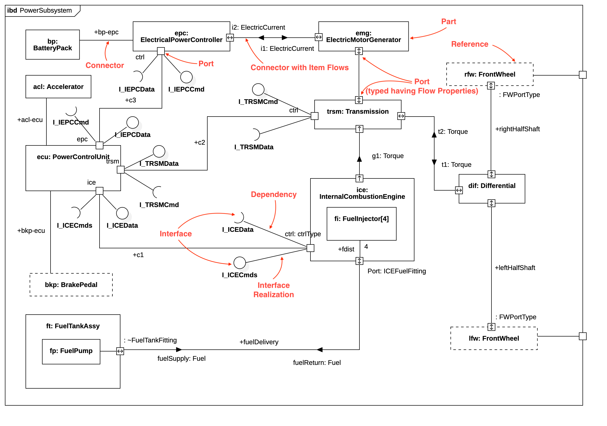

# Internal Block Diagram



## Create Block Definition Diagram

To create a Internal Block Diagram:

1. Select first a Block where a new Internal Block Diagram to be contained as a child.
2. Select **Model \| Add Diagram \| Internal Block Diagram** in Menu Bar or select **Add Diagram \| Internal Block Diagram** in Context Menu.

## Part

To create a Part:

1. Select **Part** in **Toolbox**.
2. Drag on the diagram as the size you want.

You can use **QuickEdit** for Part by double-click or press `Enter` on a selected Part.

* **Name Expression** : Edit name expression.

  _Syntax of Name Expression_

  ```text
  expression ::= [ '<<' stereotype `>>` ] [ visibility ] name
  stereotype ::= (identifier)
  visibility ::= '+' | '#' | '-' | '~'
  name ::= (identifier)
  ```

* **Visibility** : Change visibility property.
* **Add Note** : Add a linked note.
* **Add Constraint** : Add a constraint.
* **Select Block** : Select a Block and assign it to type property.
* **Create Block** : Create a Block and assign it to type property.
* **Select Value Type** : Select a Value Type and assign it to type property.
* **Create Value Type** : Create a Value Type and assign it to type property.
* **Add Port** : Add a port.

## Reference

To create a Reference:

1. Select **Reference** in **Toolbox**.
2. Drag on the diagram as the size you want.

You can use the same **QuickEdit** for [Part](internal-block-diagram.md#part) by double-click or press `Enter` on the selected Reference.

## Value

To create a Value:

1. Select **Value** in **Toolbox**.
2. Drag on the diagram as the size you want.

You can use the same **QuickEdit** for [Part](internal-block-diagram.md#part) by double-click or press `Enter` on the selected Value.

## Port

See [Port](block-definition-diagram.md#port) in Block Definition Diagram.

## Connector

See [Connector](block-definition-diagram.md#connector) in Block Definition Diagram.

