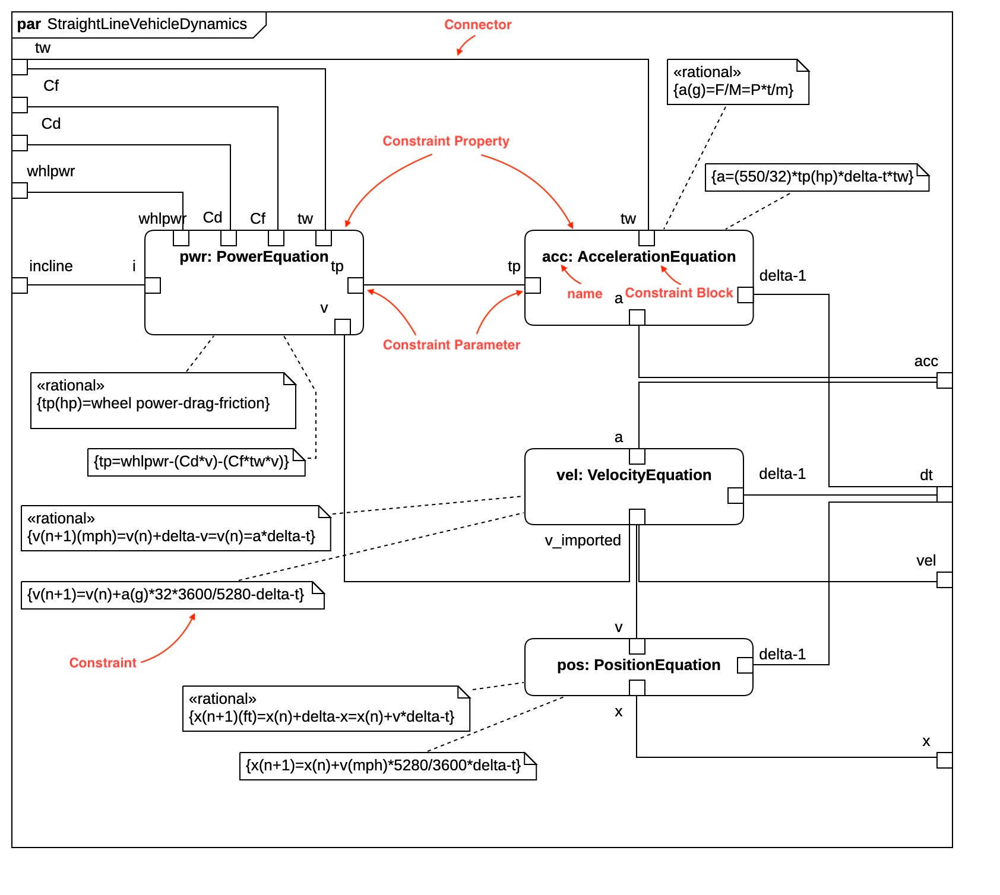

# Parametric Diagram



## Create Block Definition Diagram

To create a Parametric Diagram:

1. Select first a Constraint Block where a new Parametric Diagram to be contained as a child.
2. Select **Model \| Add Diagram \| Parametric Diagram** in Menu Bar or select **Add Diagram \| Parametric Diagram** in Context Menu.

## Constraint Property

To create a Constraint Property:

1. Select **Constraint Property** in **Toolbox**.
2. Drag on the diagram as the size you want.

To create a Constraint Property \(model element only\) by Menu:

1. Select a Constraint Block where a new Constraint Property to be contained.
2. Select **Model \| Add \| Constraint Property** in Menu Bar or **Add \| Constraint Property** in Context Menu.

You can use **QuickEdit** for Constraint Property by double-click or press `Enter` on a selected Constraint Property.

* **Name Expression** : Edit name expression.

  _Syntax of Name Expression_

  ```text
  expression ::= [ '<<' stereotype `>>` ] [ visibility ] name
  stereotype ::= (identifier)
  visibility ::= '+' | '#' | '-' | '~'
  name ::= (identifier)
  ```

* **Visibility** : Change visibility property.
* **Add Note** : Add a linked note.
* **Add Constraint** : Add a constraint.
* **Select Constraint Block** : Select a Constraint Block and assign it to type property.
* **Create Constraint Block** : Create a Constraint Block and assign it to type property.
* **Add Constraint Parameter** : Add a constraint parameter.

## Constraint Parameter

To create a Constraint Parameter:

1. Select **Constraint Parameter** in **Toolbox**.
2. Click on the element \(e.g. Constraint Property or Parametric Diagram Frame\) where Constraint Parameter to be contained.

You can use **QuickEdit** for Constraint Parameter by double-click or press `Enter` on a selected Constraint Parameter.

* **Name Expression** : Edit name expression.

  _Syntax of Name Expression_

  ```text
  expression ::= [ '<<' stereotype `>>` ] [ visibility ] name
  stereotype ::= (identifier)
  visibility ::= '+' | '#' | '-' | '~'
  name ::= (identifier)
  ```

* **Visibility** : Change visibility property.
* **Add Note** : Add a linked note.
* **Add Constraint** : Add a constraint.
* **Select Block** : Select a Block and assign it to type property.
* **Create Block** : Create a Block and assign it to type property.

