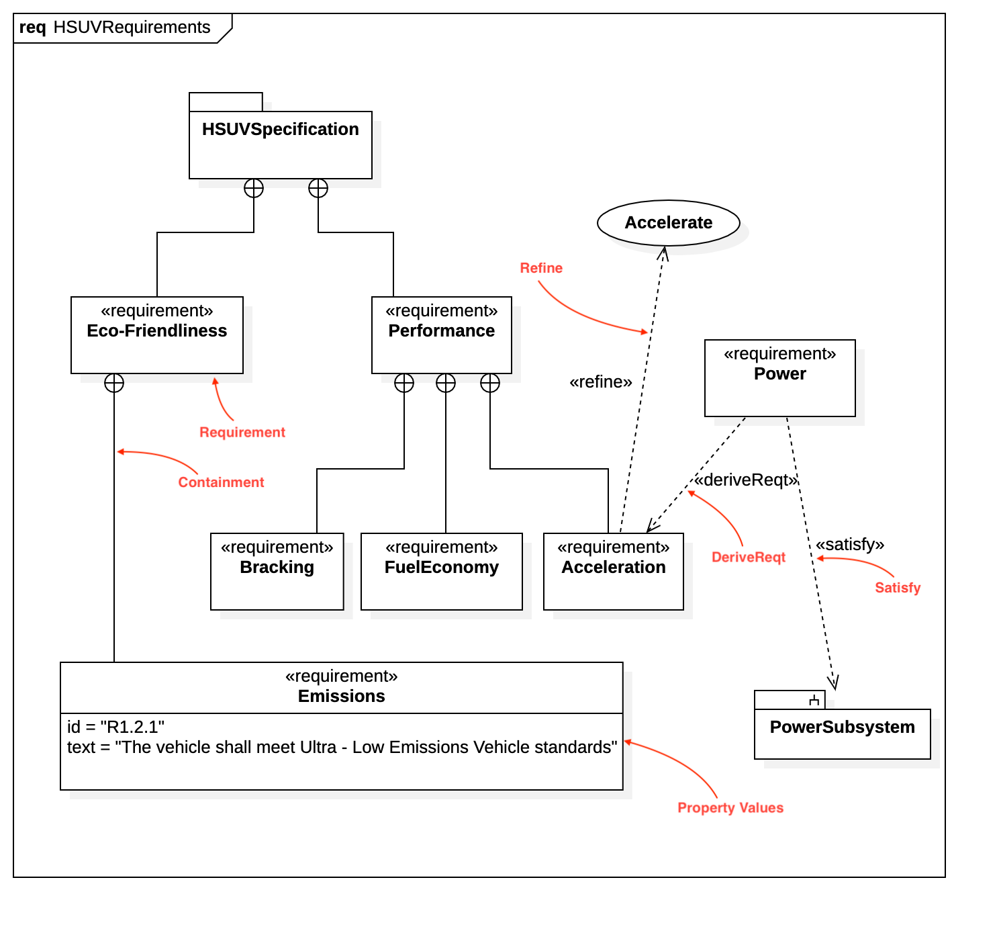

# Requirement Diagram




## Create Requirement Diagram

To create a Requirement Diagram:

1. Select first an element where a new Requirement Diagram to be contained as a child.
2. Select **Model \| Add Diagram \| Requirement Diagram** in Menu Bar or select **Add Diagram \| Requirement Diagram** in Context Menu.

## Requirement

To create a Requirement:

1. Select **Requirement** in **Toolbox**.
2. Drag on the diagram as the size you want.

You can use **QuickEdit** for Requirement by double-click or press `Enter` on a selected Requirement.

* **Name Expression** : Edit name expression.

  _Syntax of Name Expression_

  ```text
  expression ::= [ '<<' stereotype `>>` ] [ visibility ] name
  stereotype ::= (identifier)
  visibility ::= '+' | '#' | '-' | '~'
  name ::= (identifier)
  ```

* **Visibility** : Change visibility property.
* **Add Note** : Add a linked note.
* **Add Constraint**: Add a constraint.
* **Add Sub-Requirement** : Add a Requirement with a contained relationship.

To suppress Property Values, check \(or uncheck\) **Format \| Suppress Property Values** in Menu Bar or Context Menu

## Copy

To create a Copy:

1. Select **Copy** in **Toolbox**.
2. Drag from an element \(to be special\) and drop on another element \(to be general\).

You can use **QuickEdit** for Relationship \(See [Relationship](../working-with-uml-diagrams/class-diagram.md#relationship)\).

## DeriveReqt

To create a DeriveReqt:

1. Select **DeriveReqt** in **Toolbox**.
2. Drag from an element \(to be special\) and drop on another element \(to be general\).

You can use **QuickEdit** for Relationship \(See [Relationship](../working-with-uml-diagrams/class-diagram.md#relationship)\).

## Verify

To create a Verify:

1. Select **Verify** in **Toolbox**.
2. Drag from an element \(to be special\) and drop on another element \(to be general\).

You can use **QuickEdit** for Relationship \(See [Relationship](../working-with-uml-diagrams/class-diagram.md#relationship)\).

## Satisfy

To create a Satisfy:

1. Select **Satisfy** in **Toolbox**.
2. Drag from an element \(to be special\) and drop on another element \(to be general\).

You can use **QuickEdit** for Relationship \(See [Relationship](../working-with-uml-diagrams/class-diagram.md#relationship)\).

## Refine

To create a Refine:

1. Select **Refine** in **Toolbox**.
2. Drag from an element \(to be special\) and drop on another element \(to be general\).

You can use **QuickEdit** for Relationship \(See [Relationship](../working-with-uml-diagrams/class-diagram.md#relationship)\).

