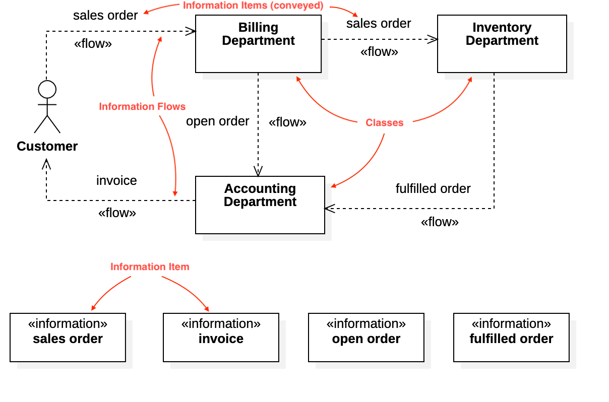

# Information Flow Diagram



## Create Information Flow Diagram

To create a Information Flow Diagram:

1. Select first an element where a new Information Flow Diagram to be contained as a child.
2. Select **Model \| Add Diagram \| Information Flow Diagram** in Menu Bar or select **Add Diagram \| Information Flow Diagram** in Context Menu.

> **See also**
>
> [UML Information Flow Diagram](https://www.uml-diagrams.org/information-flow-diagrams.html) - For more information about UML Information Flow Diagram

## Information Item

To create an Information Item:

1. Select **Information Item** in **Toolbox**.
2. Drag on the diagram as the size of Information Item.

You can use **QuickEdit** for Information Item by double-click or press `Enter` on a selected Information Item.

* **Name Expression** : Edit name expression.

  _Syntax of Name Expression_

  ```text
  expression ::= [ '<<' stereotype `>>` ] [ visibility ] name
  stereotype ::= (identifier)
  visibility ::= '+' | '#' | '-' | '~'
  name ::= (identifier)
  ```

* **Visibility** : Change visibility property.
* **Add Note** : Add a linked note.
* **Add Constraint**: Add a constraint.
* **Add Attribute** \(`Ctrl+Enter`\) : Add an attribute.
* **Add Operation** \(`Ctrl+Shift+Enter`\) : Add an operation.
* **Add Reception** : Add a reception.

To suppress Attributes, see [Suppress Attributes](../user-guide/formatting-diagram.md#suppress-attributes).

To suppress Operations, see [Suppress Operations](../user-guide/formatting-diagram.md#suppress-operations).

To suppress Receptions, see [Suppress Receptions](../user-guide/formatting-diagram.md#suppress-receptions).

To show or hide Operation Signatures, see [Show Operation Signature](../user-guide/formatting-diagram.md#show-operation-signature).

## Information Flow

To create an Information Flow:

1. Select **Information Flow** in **Toolbox**.
2. Drag from an element and drop on another element.

You can use **QuickEdit** for Relationship \(See [Relationship](class-diagram.md#relationship)\).

