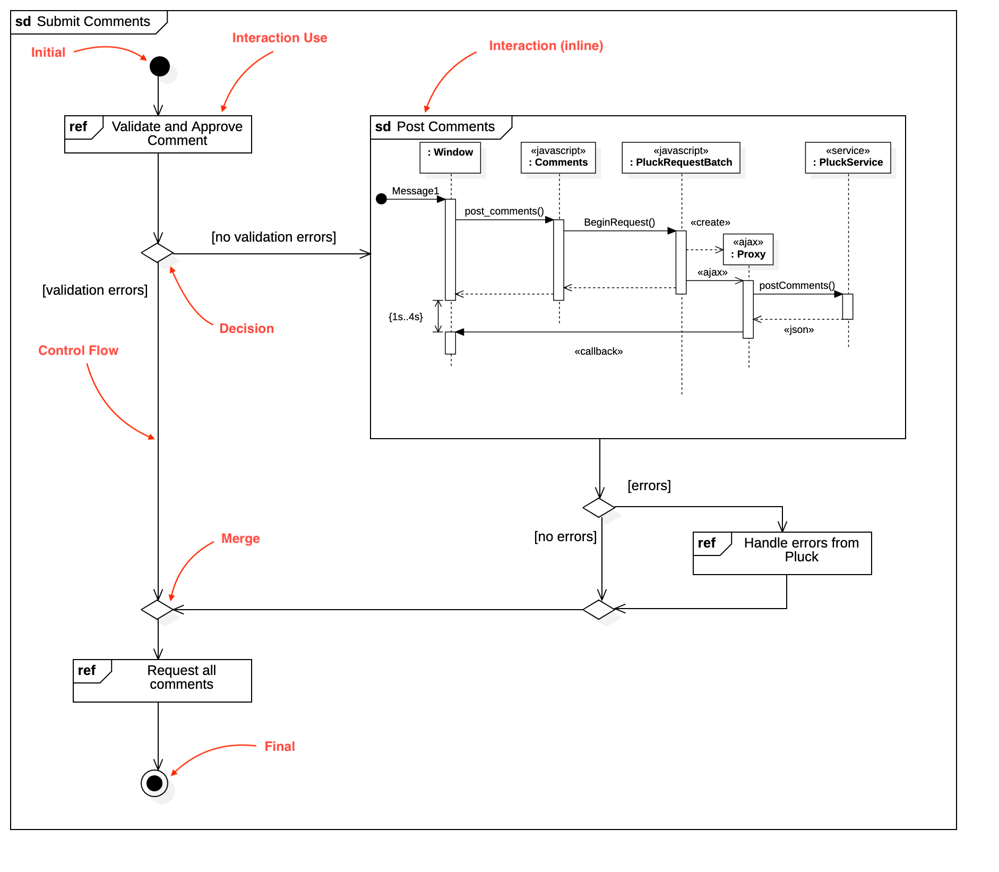

# Interaction Overview Diagram

## Create Interaction Overview Diagram

To create an Interaction Overview Diagram:

1. Select first an element where a new Interaction Overview Diagram to be contained as a child.
2. Select **Model \| Add Diagram \| Interaction Overview Diagram** in Menu Bar or select **Add Diagram \| Interaction Overview Diagram** in Context Menu.

> **See also**
>
> [UML Interaction Overview Diagram](https://www.uml-diagrams.org/interaction-overview-diagrams.html) - For more information about UML Interaction Overview Diagram

> Note that Interaction Overview Diagram is a kind of Activity Diagram, so all nodes are activity nodes and all edges are activity edges.

## Interaction Use

To create a Interaction Use node:

1. Select **Interaction Use** in **Toolbox**.
2. Drag on the diagram as the size of Interaction Use.

You can also create an Interaction Use node by drag and drop an existing Interaction Use from Model Explorer.

Double-clicking the node will select the corresponding Interaction Use element in Model Explorer.

## Interaction \(inline\)

To create a Interaction \(inline\) node:

1. Select **Interaction \(inline\)** in **Toolbox**.
2. Drag on the diagram as the size of Interaction.

Creating an Interaction \(inline\) node will also create a new Sequence Diagram. The sequence diagram is shown inside the Interaction Frame.

To edit the sequence diagram inside, double-click the Interaction Frame.

You can also create Interaction \(inline\) node by drag and drop an existing Sequence Diagram from Model Explorer.

## Initial

To create an Initial node:

1. Select **Initial** in **Toolbox**.
2. Click at the position on the diagram.

## Final

To create a Final node:

1. Select **Final** in **Toolbox**.
2. Click at the position on the diagram.

## Fork

To create a Fork node:

1. Select **Fork** in **Toolbox**.
2. Drag on the diagram as the size of Fork.

## Join

To create a Join node:

1. Select **Join** in **Toolbox**.
2. Drag on the diagram as the size of Join.

## Merge

To create a Merge node:

1. Select **Merge** in **Toolbox**.
2. Click at the position on the diagram.

## Decision

To create a Decision node:

1. Select **Decision** in **Toolbox**.
2. Click at the position on the diagram.

## Control Flow

To create a Control Flow:

1. Select **Control Flow** in **Toolbox**.
2. Drag from a node and drop on another node.

You can use **QuickEdit** for Relationship \(See [Relationship](class-diagram.md#relationship)\).

