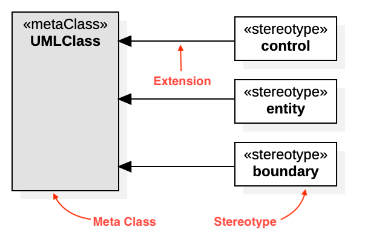

# Profile Diagram



## Create Profile Diagram

To create a Profile Diagram:

1. Select first an element where a new Profile Diagram to be contained as a child.
2. Select **Model \| Add Diagram \| Profile Diagram** in Menu Bar or select **Add Diagram \| Profile Diagram** in Context Menu.

> **See also**
>
> [UML Profile Diagram](http://www.uml-diagrams.org/profile-diagrams.html) - For more information about UML Profile Diagram.

## Profile

To create a Profile \(model element only\) by Menu:

1. Select an Element where a new Profile to be contained.
2. Select **Model \| Add \| Profile** in Menu Bar or **Add \| Profile** in Context Menu.

## MetaClass

To create a MetaClass:

1. Select **MetaClass** in **Toolbox**.
2. Drag on the diagram as the size of MetaClass.

To create a MetaClass \(model element only\) by Menu:

1. Select an Element where a new MetaClass to be contained.
2. Select **Model \| Add \| MetaClass** in Menu Bar or **Add \| MetaClass** in Context Menu.

You can use **QuickEdit** for MetaClass by double-click or press `Enter` on a selected MetaClass.

* **Name Expression** : Edit name expression.

  _Syntax of Name Expression_

  ```text
  expression ::= [ '<<' stereotype `>>` ] [ visibility ] name
  stereotype ::= (identifier)
  visibility ::= '+' | '#' | '-' | '~'
  name ::= (identifier)
  ```

* **Visibility** : Change visibility property.
* **Add Note** : Add a linked note.
* **Add Constraint** : Add a constraint.
* **Add Stereotype** : Add a stereotype with a connected extension.

## Stereotype

To create a Stereotype:

1. Select **Stereotype** in **Toolbox**.
2. Drag on the diagram as the size of Stereotype.

To create a Stereotype \(model element only\) by Menu:

1. Select an Element where a new Stereotype to be contained.
2. Select **Model \| Add \| Stereotype** in Menu Bar or **Add \| Stereotype** in Context Menu.

You can use **QuickEdit** for Stereotype by double-click or press `Enter` on a selected Stereotype.

* **Name Expression** : Edit name expression.

  _Syntax of Name Expression_

  ```text
  expression ::= [ '<<' stereotype `>>` ] [ visibility ] name
  stereotype ::= (identifier)
  visibility ::= '+' | '#' | '-' | '~'
  name ::= (identifier)
  ```

* **Visibility** : Change visibility property.
* **Add Note** : Add a linked note.
* **Add Constraint** : Add a constraint.
* **Add Attribute** \(`Ctrl+Enter`\) : Add an attribute.
* **Add Operation** \(`Ctrl+Shift+Enter`\) : Add an operation.
* **Add Sub-Stereotype** : Add a sub-stereotype.
* **Add Super-Stereotype** : Add a super stereotype.

To suppress Attributes, see [Suppress Attributes](../user-guide/formatting-diagram.md#suppress-attributes).

To suppress Operations, see [Suppress Operations](../user-guide/formatting-diagram.md#suppress-operations).

To show or hide Operation Signatures, see [Show Operation Signature](../user-guide/formatting-diagram.md#show-operation-signature).

## Extension

To create a Extension:

1. Select **Extension** in **Toolbox**.
2. Drag from a Stereotype and drop on a MetaClass.

You can use **QuickEdit** for Relationship \(See [Relationship](class-diagram.md#relationship)\).

